# Sistema Inteligente de Apoio ao Diagnóstico de Câncer de Mama

- **Grupo** 153
- **Link do vídeo no YouTube** https://youtu.be/dtRQA70C1fQ
- **Participante(s):** Wesley Adolpho de Lima Klein  
- **Referência**  "IADT - Fase 1 - Tech challenge B.pdf"
- **Repositório Git** https://github.com/wesleyklein/IADT-Fase1-Tech-challengeB 
- **Projeto:** FIAP – IADT Fase 1 – Tech Challenge B  
- **Tema:** Machine Learning aplicado ao apoio ao diagnóstico médico  
- **Dataset:** Breast Cancer Wisconsin Diagnostic Dataset  
- **Problema:** Classificação de tumores em benignos ou malignos  
- **Curso:** IA para Devs - Pós Tech - 9IADT
- **Data:** 01/05/2026


---

## 1. Resumo Executivo

Este projeto apresenta a construção de uma solução inicial de Inteligência Artificial com foco em Machine Learning para apoiar a análise inicial de exames médicos. A proposta está alinhada ao desafio da FIAP, que solicita uma solução capaz de processar dados médicos e auxiliar equipes clínicas na triagem e no suporte à decisão.

A base escolhida foi o **Breast Cancer Wisconsin**, um dataset público utilizado para classificação de tumores de mama em duas classes: **benigno** e **maligno**. O objetivo principal foi construir, comparar e avaliar modelos de classificação capazes de identificar corretamente casos malignos, reduzindo principalmente o risco de **falsos negativos**.

No contexto médico, um falso negativo ocorre quando o modelo classifica um tumor maligno como benigno. Esse é o erro mais crítico do problema, pois pode atrasar a investigação médica e comprometer o tratamento do paciente. Por esse motivo, a métrica priorizada neste trabalho foi o **recall da classe maligna**.

Após a exploração dos dados, limpeza, pré-processamento, treinamento de modelos, validação cruzada e otimização com `GridSearchCV`, o melhor modelo identificado foi a **Regressão Logística otimizada**, que apresentou ótimo equilíbrio entre desempenho, interpretabilidade e sensibilidade para identificar tumores malignos.

---

## 2. Contextualização do Problema

Um hospital universitário deseja implementar uma solução inteligente de apoio ao diagnóstico médico. O objetivo não é substituir médicos, mas oferecer uma ferramenta de apoio que ajude na análise inicial de exames e dados clínicos.

Neste projeto, a abordagem foi baseada em dados estruturados. Cada registro da base representa características extraídas de exames de células da mama, e o modelo deve prever se o tumor é benigno ou maligno.

### 2.1 Tipo de problema

O problema é uma **classificação supervisionada binária**.

Isso significa que:

- O modelo recebe exemplos já classificados.
- Cada exemplo possui variáveis de entrada, chamadas de features.
- Cada exemplo possui uma resposta conhecida, chamada de variável alvo.
- O objetivo é aprender padrões nos dados para prever novos casos.

### 2.2 Classes do problema

| Código | Classe | Significado |
|---:|---|---|
| 0 | Benigno | Tumor não cancerígeno |
| 1 | Maligno | Tumor cancerígeno |

A classe mais crítica é a classe **1**, pois representa os casos malignos.

---

## 3. Dataset Utilizado

O dataset utilizado foi o **Breast Cancer Wisconsin Diagnostic Dataset**, disponível publicamente no Kaggle.

A base contém medidas numéricas extraídas de imagens digitalizadas de punção aspirativa por agulha fina de massas mamárias. Essas medidas descrevem características das células analisadas, como raio, textura, perímetro, área, suavidade, compactação, concavidade, pontos côncavos, simetria e dimensão fractal.

### 3.1 Estrutura inicial da base

Na exploração inicial, a base possuía:

| Item | Valor |
|---|---:|
| Registros | 569 |
| Colunas iniciais | 33 |
| Variável alvo original | `diagnosis` |
| Coluna identificadora | `id` |
| Coluna vazia | `Unnamed: 32` |

Coluna identificadora e vazia foram removidas

### 3.2 Distribuição das classes

| Classe | Quantidade | Percentual aproximado |
|---|---:|---:|
| Benigno | 357 | 62,7% |
| Maligno | 212 | 37,3% |

A base é considerada **moderadamente desbalanceada**, pois há mais casos benignos do que malignos. Isso exige cuidado na escolha das métricas, porque uma acurácia alta pode esconder problemas na identificação da classe minoritária.

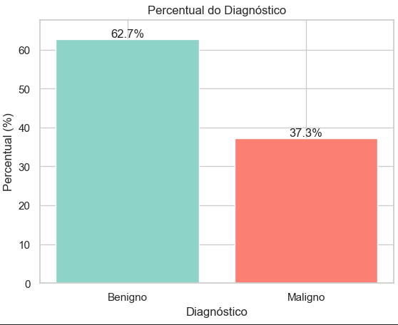

---

## 4. Dicionário de Dados

As colunas originais foram traduzidas para português para facilitar a leitura e a apresentação do projeto.

### 4.1 Variável alvo

| Coluna original | Coluna em português | Descrição |
|---|---|---|
| `diagnosis` | `diagnostico` | Resultado do diagnóstico: 0 para benigno e 1 para maligno |


### 4.2 Variáveis principais: médias

As colunas com sufixo `_mean` representam o valor médio das características analisadas.

| Coluna original | Coluna em português | Descrição |
|---|---|---|
| `radius_mean` | `raio_media` | Média das distâncias do centro até a borda da célula |
| `texture_mean` | `textura_media` | Variação média dos tons de cinza na imagem |
| `perimeter_mean` | `perimetro_media` | Perímetro médio das células analisadas |
| `area_mean` | `area_media` | Área média das células analisadas |
| `smoothness_mean` | `suavidade_media` | Variação local média no raio da célula |
| `compactness_mean` | `compactacao_media` | Medida média de compactação da célula |
| `concavity_mean` | `concavidade_media` | Grau médio de concavidade do contorno celular |
| `concave points_mean` | `pontos_concavos_media` | Quantidade média de pontos côncavos no contorno |
| `symmetry_mean` | `simetria_media` | Simetria média da célula |
| `fractal_dimension_mean` | `dimensao_fractal_media` | Complexidade média do contorno celular |

### 4.3 Variáveis de erro padrão

As colunas com sufixo `_se` representam o erro padrão das medições.

| Coluna original | Coluna em português | Descrição |
|---|---|---|
| `radius_se` | `raio_erro_padrao` | Erro padrão do raio |
| `texture_se` | `textura_erro_padrao` | Erro padrão da textura |
| `perimeter_se` | `perimetro_erro_padrao` | Erro padrão do perímetro |
| `area_se` | `area_erro_padrao` | Erro padrão da área |
| `smoothness_se` | `suavidade_erro_padrao` | Erro padrão da suavidade |
| `compactness_se` | `compactacao_erro_padrao` | Erro padrão da compactação |
| `concavity_se` | `concavidade_erro_padrao` | Erro padrão da concavidade |
| `concave points_se` | `pontos_concavos_erro_padrao` | Erro padrão dos pontos côncavos |
| `symmetry_se` | `simetria_erro_padrao` | Erro padrão da simetria |
| `fractal_dimension_se` | `dimensao_fractal_erro_padrao` | Erro padrão da dimensão fractal |

### 4.4 Variáveis de pior caso

As colunas com sufixo `_worst` representam os maiores ou piores valores observados entre as medições. Elas são importantes porque podem destacar alterações mais intensas relacionadas a malignidade.

| Coluna original | Coluna em português | Descrição |
|---|---|---|
| `radius_worst` | `raio_pior` | Pior valor observado para raio |
| `texture_worst` | `textura_pior` | Pior valor observado para textura |
| `perimeter_worst` | `perimetro_pior` | Pior valor observado para perímetro |
| `area_worst` | `area_pior` | Pior valor observado para área |
| `smoothness_worst` | `suavidade_pior` | Pior valor observado para suavidade |
| `compactness_worst` | `compactacao_pior` | Pior valor observado para compactação |
| `concavity_worst` | `concavidade_pior` | Pior valor observado para concavidade |
| `concave points_worst` | `pontos_concavos_pior` | Pior valor observado para pontos côncavos |
| `symmetry_worst` | `simetria_pior` | Pior valor observado para simetria |
| `fractal_dimension_worst` | `dimensao_fractal_pior` | Pior valor observado para dimensão fractal |


---

## 5. Análise Exploratória dos Dados

A análise exploratória teve como objetivo entender a estrutura da base, validar a qualidade dos dados e identificar possíveis relações entre as variáveis e o diagnóstico.

### 5.1 Verificação inicial

Foram realizadas as seguintes verificações:

- Quantidade de linhas e colunas.
- Tipos de dados.
- Valores ausentes.
- Colunas vazias.
- Duplicidade de identificadores.
- Distribuição da variável alvo.

### 5.2 Valores ausentes

A base não apresentou valores ausentes relevantes nas variáveis úteis. A única coluna completamente vazia foi `Unnamed: 32`, removida durante a limpeza.

### 5.3 Duplicidade de IDs

Foi verificado que não havia IDs duplicados. Isso indica que cada registro representa um caso distinto.

---

## 6. Limpeza dos Dados

A etapa de limpeza preparou a base para a modelagem.

### 6.1 Remoção de colunas desnecessárias

Foram removidas as colunas:

| Coluna | Motivo da remoção |
|---|---|
| `id` | Identificador do registro, sem valor preditivo para o modelo |
| `Unnamed: 32` | Coluna vazia, sem informação útil |

A coluna `id` é importante para controle da base, mas não deve ser usada no treinamento, pois não representa característica clínica do tumor.

### 6.2 Conversão da variável alvo

A coluna original `diagnosis` possuía valores categóricos:

| Valor original | Conversão | Significado |
|---|---:|---|
| B | 0 | Benigno |
| M | 1 | Maligno |

Essa conversão foi necessária porque os algoritmos de Machine Learning trabalham melhor com dados numéricos. Além disso, definir maligno como `1` facilita a interpretação das métricas da classe positiva.

### 6.3 Tradução das colunas

As colunas foram traduzidas para português para facilitar a análise, documentação e apresentação do projeto.

### 6.4 Resultado da limpeza

Após a limpeza, a base ficou com:

| Item | Valor |
|---|---:|
| Registros | 569 |
| Variável alvo | `diagnostico` |
| Variáveis preditoras | 30 |
| Total de colunas | 31 |

---

## 7. Análise de Correlação

A análise de correlação foi utilizada para identificar quais variáveis possuem maior associação com o diagnóstico maligno.

A correlação varia de -1 a 1:

| Valor | Interpretação |
|---:|---|
| Próximo de 1 | Forte associação positiva |
| Próximo de 0 | Baixa ou nenhuma associação linear |
| Próximo de -1 | Forte associação negativa |

Como a variável `diagnostico` foi codificada com `1 = maligno`, correlações positivas indicam variáveis que tendem a aumentar quando o tumor é maligno.

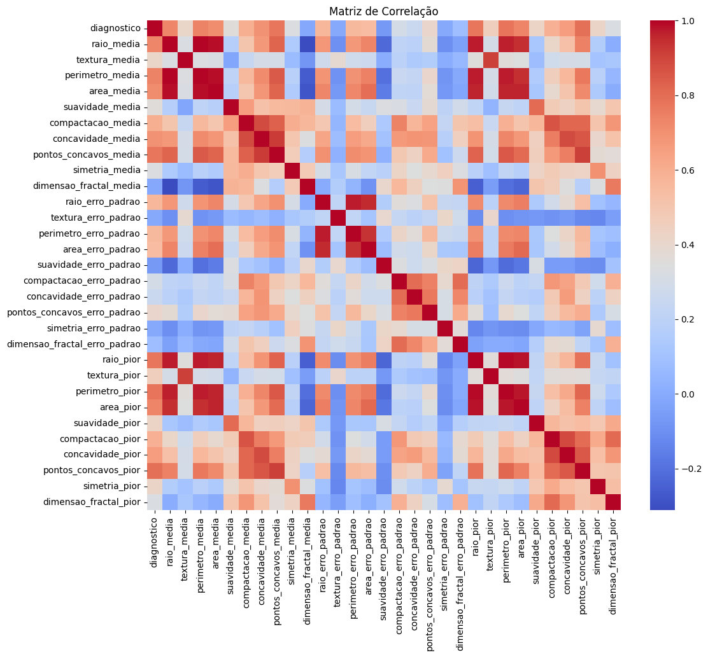

### 7.1 Variáveis mais correlacionadas com malignidade

| Variável | Correlação com `diagnostico` | Interpretação |
|---|---:|---|
| `pontos_concavos_pior` | 0.793566 | Forte associação com malignidade |
| `perimetro_pior` | 0.782914 | Tumores malignos tendem a apresentar maior perímetro |
| `pontos_concavos_media` | 0.776614 | Irregularidade média do contorno é relevante |
| `raio_pior` | 0.776454 | Tumores malignos tendem a apresentar maior raio |
| `perimetro_media` | 0.742636 | Perímetro médio se associa à classe maligna |
| `area_pior` | 0.733825 | Área elevada aparece fortemente associada à malignidade |
| `raio_media` | 0.730029 | Raio médio maior tende a aparecer em tumores malignos |
| `area_media` | 0.708984 | Área média maior tende a indicar maior risco |
| `concavidade_media` | 0.696360 | Concavidade média é um indicador importante |
| `concavidade_pior` | 0.659610 | Concavidade no pior caso também é relevante |

### 7.2 Interpretação clínica dos padrões

Os resultados mostram que variáveis relacionadas a **tamanho**, **área**, **perímetro**, **concavidade** e **pontos côncavos** possuem forte associação com a malignidade.

De forma simplificada, tumores malignos tendem a apresentar:

- Formato mais irregular.
- Maior área.
- Maior perímetro.
- Mais concavidades.
- Mais pontos côncavos.

Essa análise ajuda a justificar por que essas variáveis aparecem posteriormente como importantes nos modelos.

---

## 8. Preparação dos Dados para Modelagem

Após a limpeza e análise exploratória, os dados foram preparados para treinamento dos modelos.


### 8.1 Separação entre X e y

Foram separados:

| Elemento | Descrição |
|---|---|
| `X` | Variáveis de entrada, ou seja, as características do tumor |
| `y` | Variável alvo, ou seja, o diagnóstico |

A coluna `diagnostico` foi removida de `X` e armazenada em `y`.

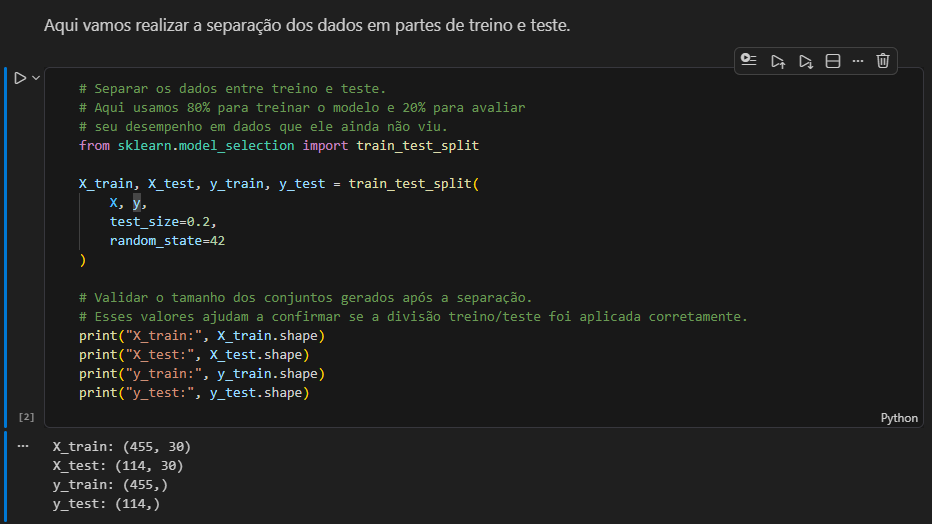

### 8.2 Separação treino e teste

Foi utilizado `train_test_split` para separar a base em dados de treino e teste.

| Conjunto | Percentual | Finalidade |
|---|---:|---|
| Treino | 80% | Usado para treinar o modelo |
| Teste | 20% | Usado para avaliar o modelo em dados não vistos |

O conjunto de teste simula novos casos que o modelo ainda não conhece.

### 8.3 Uso de `stratify=y`

Foi recomendado o uso de `stratify=y` para preservar a proporção entre benignos e malignos nos conjuntos de treino e teste.

Isso é importante porque a base possui leve desbalanceamento. Sem estratificação, o conjunto de teste poderia ficar com proporção diferente da base original, prejudicando a avaliação.

### 8.4 Padronização com `StandardScaler`

Foi utilizado `StandardScaler` para padronizar as variáveis numéricas.

A padronização transforma os dados para que fiquem com:

- Média próxima de 0.
- Desvio padrão próximo de 1.

Essa etapa é importante principalmente para modelos sensíveis à escala, como:

- Regressão Logística.
- KNN.

A Árvore de Decisão não depende tanto de padronização, mas manter um pipeline padronizado facilita a comparação entre modelos.

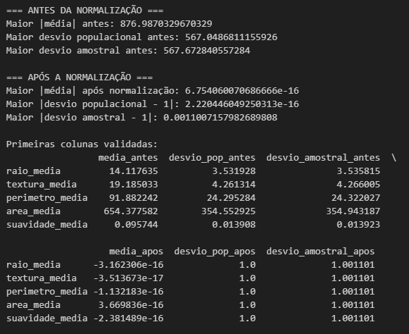


### 8.5 Observação sobre valores negativos após normalização

Após a padronização, é normal aparecerem valores negativos. Isso não significa que o dado está errado.

Um valor negativo indica apenas que aquela observação está abaixo da média daquela variável. Por exemplo:

- Valor padronizado positivo: acima da média.
- Valor padronizado negativo: abaixo da média.
- Valor próximo de zero: próximo da média.

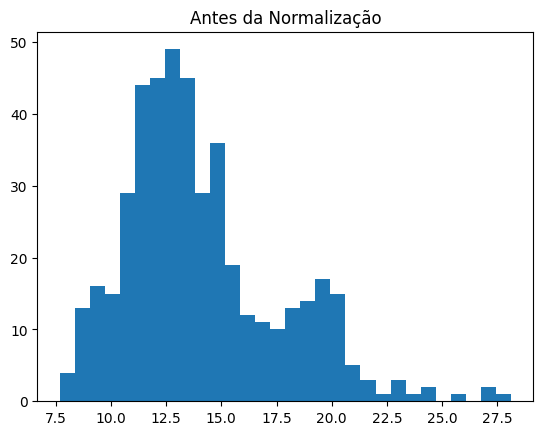


---

#### A Arquitetura da Pipeline

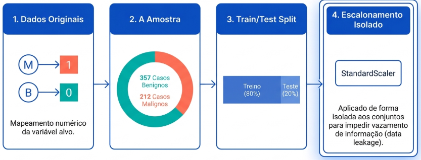

## 9. Modelos Utilizados

Foram utilizados três modelos de classificação para comparação.

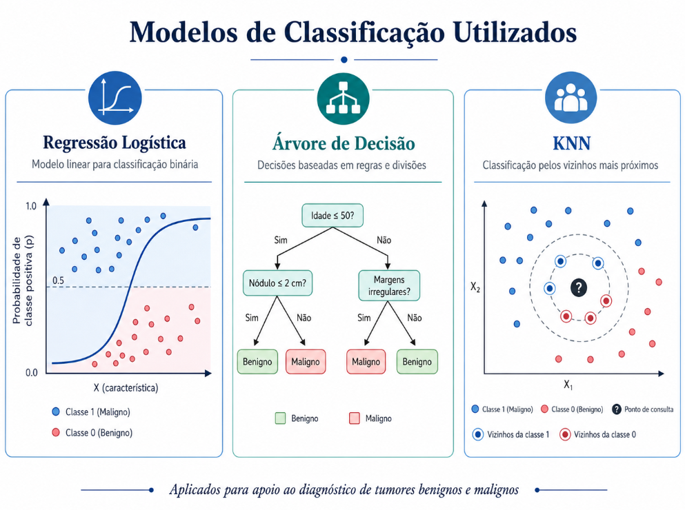

### 9.1 Regressão Logística

A Regressão Logística é um modelo linear usado para classificação. Apesar do nome conter “regressão”, ela é muito usada em problemas de classificação binária.

Ela estima a probabilidade de um caso pertencer à classe positiva. Neste projeto, a classe positiva é o tumor maligno.

Vantagens:

- Boa performance em bases tabulares.
- Fácil interpretação.
- Permite analisar coeficientes.
- Boa opção para contexto médico por ser mais explicável.

Resultado:

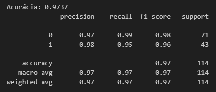

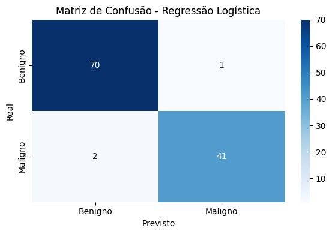

### 9.2 Árvore de Decisão

A Árvore de Decisão cria regras de decisão baseadas nas variáveis do dataset.

Vantagens:

- Fácil visualização.
- Fácil explicação.
- Permite analisar importância das variáveis.

Limitações:

- Pode sofrer overfitting se a profundidade não for controlada.
- Pode ser menos estável que modelos lineares.

Resultado:

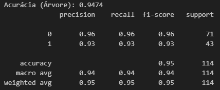

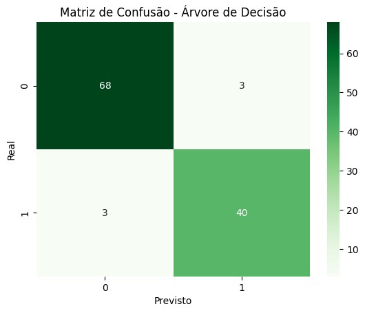

- Visualizar Árvore

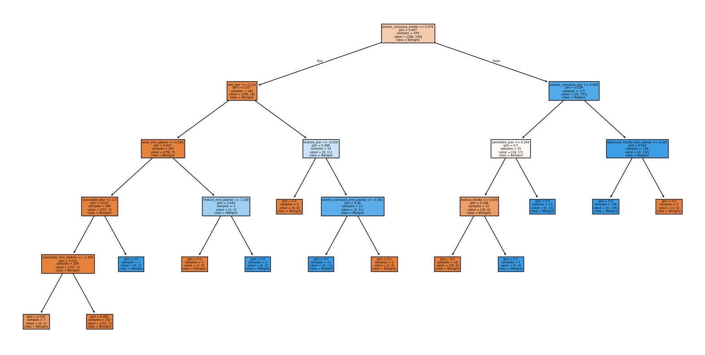

### 9.3 KNN

O KNN classifica um novo caso com base nos exemplos mais próximos no conjunto de treino.

Vantagens:

- Simples de entender.
- Pode funcionar bem em bases pequenas.

Limitações:

- Sensível à escala dos dados.
- Pode perder desempenho com muitas variáveis.
- Menos interpretável que a Regressão Logística e a Árvore.

Resultado (5 vizinhos):

 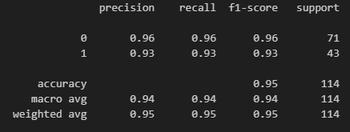

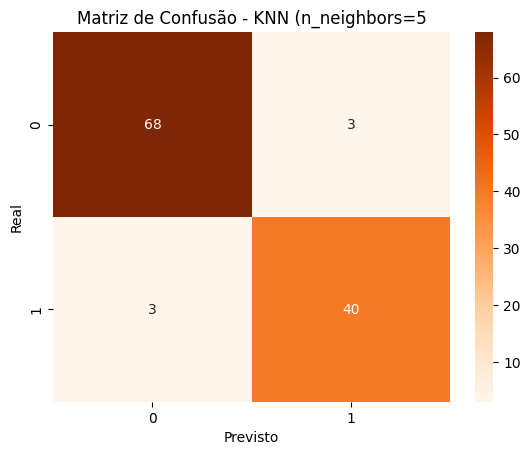

Resultado (9 vizinhos):

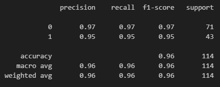


Para o KNN também testamos diferentes valores de k

K=3 → Acurácia: 0.9474
K=5 → Acurácia: 0.9474
K=7 → Acurácia: 0.9474
K=9 → Acurácia: 0.9649

---

## 10. Resultados Iniciais dos Modelos

A primeira comparação foi feita com os modelos base.

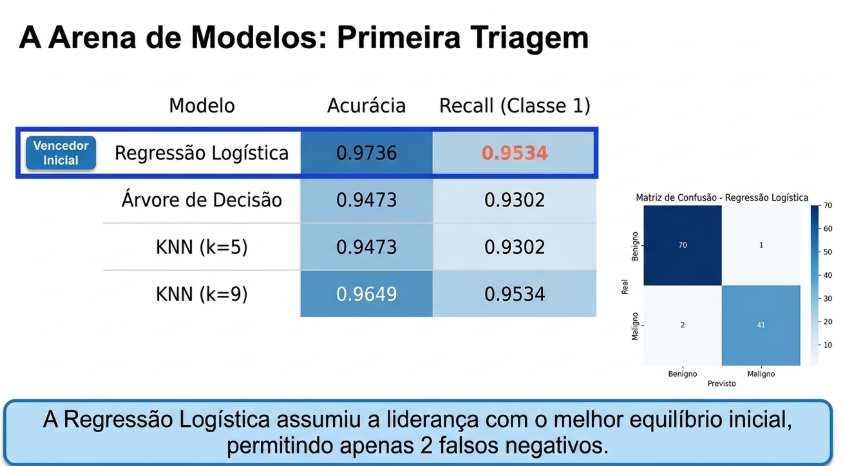

| Modelo | Acurácia | Precisão Classe 1 | Recall Classe 1 | F1-score Classe 1 |
|---|---:|---:|---:|---:|
| Regressão Logística | 0.973684 | 0.976190 | 0.953488 | 0.964706 |
| Árvore de Decisão | 0.947368 | 0.930233 | 0.930233 | 0.930233 |
| KNN k=5 | 0.947368 | 0.930233 | 0.930233 | 0.930233 |
| KNN k=9 | 0.964912 | 0.953488 | 0.953488 | 0.953488 |

### 10.1 Interpretação dos resultados iniciais

A Regressão Logística teve o melhor desempenho inicial geral. Ela apresentou alta acurácia e bom recall para a classe maligna.

A Árvore de Decisão e o KNN com k=5 apresentaram desempenho semelhante, mas inferior ao da Regressão Logística.

O KNN com k=9 melhorou em relação ao KNN com k=5, alcançando recall semelhante ao da Regressão Logística inicial.

---

## 11. Matriz de Confusão

A matriz de confusão é uma das formas mais importantes de avaliar um modelo de classificação, pois mostra onde o modelo acertou e onde errou.

### 11.1 Conceitos

| Termo | Significado no projeto |
|---|---|
| TN | Benigno previsto como benigno |
| TP | Maligno previsto como maligno |
| FP | Benigno previsto como maligno |
| FN | Maligno previsto como benigno |

### 11.2 Matriz da Regressão Logística inicial

| Situação | Quantidade | Interpretação |
|---|---:|---|
| TN | 70 | Casos benignos corretamente classificados |
| FP | 1 | Caso benigno classificado como maligno |
| FN | 2 | Casos malignos classificados como benignos |
| TP | 41 | Casos malignos corretamente classificados |

### 11.3 Matriz da Regressão Logística Otimizada

Nesta etapa, utilizamos o threshold de **0.45** como ponto de corte para a decisão da Regressão Logística Otimizada. Com esse ajuste, o modelo passou a ser mais sensível na identificação da classe maligna e reduziu os falsos negativos de **2 para 1**. Em outras palavras, deixou de não identificar dois tumores malignos e passou a deixar apenas um caso sem identificação no conjunto de teste.

O melhor ponto de corte observado foi **0.45**, pois a partir desse valor não houve melhora adicional na identificação dos casos malignos. Dessa forma, o único caso não identificado nesse cenário pode ser entendido como um caso residual dentro da amostra avaliada.

### Threshold 0.50
- Acertou 70 benignos.
- Errou 1 benigno como maligno.
- Deixou passar 2 malignos como benignos.
- Acertou 41 malignos.

### Threshold 0.45
- Acertou 70 benignos.
- Errou 1 benigno como maligno.
- Deixou passar apenas 1 maligno como benigno.
- Acertou 42 malignos.

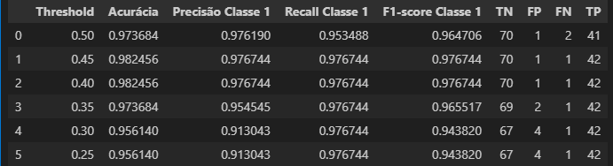

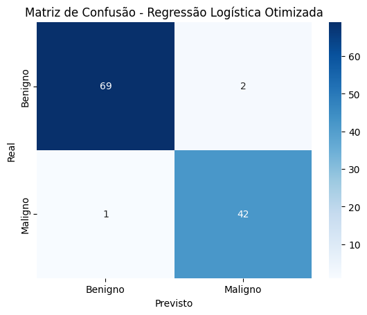

### 11.4 Análise dos falsos negativos

Com o ajuste do threshold para **0.45**, o modelo passou a deixar de identificar apenas **1 caso maligno**, em vez de 2. No contexto médico, essa melhora é relevante, pois reduz o risco de um tumor maligno passar despercebido na triagem inicial.

Mesmo com alta acurácia, a análise da matriz mostra que o projeto deve priorizar a redução dos falsos negativos, e o threshold **0.45** apresentou o melhor equilíbrio observado para esse objetivo.

---

## 12. Escolha da Métrica Principal

Em problemas médicos, nem todo erro tem o mesmo impacto.

### 12.1 Acurácia

A acurácia mede o percentual total de acertos.

Ela é útil, mas pode ser insuficiente em problemas médicos, especialmente quando há desbalanceamento entre as classes.

### 12.2 Precisão

A precisão responde à pergunta:

> Dos casos que o modelo classificou como malignos, quantos realmente eram malignos?

Ela é importante para evitar alarmes falsos, mas não é a prioridade máxima neste projeto.

### 12.3 Recall

O recall responde à pergunta:

> Dos casos que realmente eram malignos, quantos o modelo conseguiu identificar?

A fórmula é:

```text
Recall = TP / (TP + FN)
```

No contexto deste projeto, o recall da classe maligna é a métrica mais importante, porque mede a capacidade do modelo de encontrar os tumores malignos.

### 12.4 Por que o recall é prioritário?

Porque o erro mais grave é o falso negativo.

Um falso negativo significa que:

- O tumor era maligno.
- O modelo classificou como benigno.
- O paciente poderia não ser encaminhado para investigação adicional.
- O diagnóstico e o tratamento poderiam ser atrasados.

Por isso, o modelo deve ser sensível aos casos malignos, mesmo que isso aumente um pouco o número de falsos positivos.

---

## 13. Validação Cruzada K-Fold

A validação cruzada foi utilizada para avaliar a robustez dos modelos.

### 13.1 O que é validação cruzada?

A validação cruzada divide os dados de treino em várias partes. O modelo é treinado e validado várias vezes, alternando qual parte será usada como validação.

Neste projeto, foi utilizado:

```python
StratifiedKFold(n_splits=5)
```

Isso significa que o treino foi dividido em 5 partes, mantendo a proporção entre benignos e malignos em cada divisão.


### 13.2 Por que usar `StratifiedKFold`?

Como a base é moderadamente desbalanceada, é importante manter a proporção das classes em cada fold.

O `StratifiedKFold` evita que algum fold fique com muitos benignos ou poucos malignos, o que poderia gerar uma avaliação instável.

Resultado:

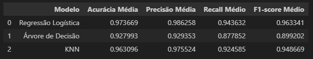

### 13.3 Evitando vazamento de dados

Na validação cruzada, a padronização precisa ser feita dentro de cada fold. Para isso, foi utilizado um pipeline com:

1. `StandardScaler`
2. Modelo

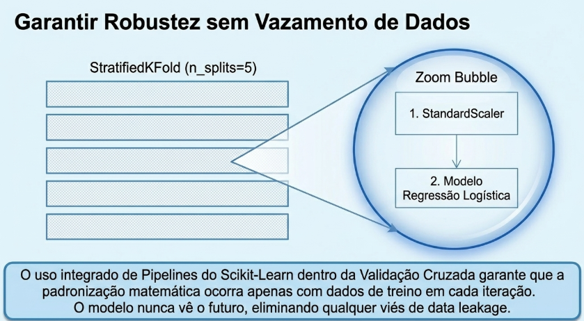

Essa estratégia evita **data leakage**, ou seja, evita que informações dos dados de validação sejam usadas durante o treinamento.

### 13.4 Resultados da validação cruzada

| Modelo | Acurácia média | Precisão média | Recall médio | F1 médio |
|---|---:|---:|---:|---:|
| Regressão Logística | 0.973669 | 0.986258 | 0.943632 | 0.963341 |
| Árvore de Decisão | 0.927993 | 0.929353 | 0.877852 | 0.899202 |
| KNN | 0.963096 | 0.975524 | 0.924585 | 0.948669 |

### 13.5 Interpretação

A Regressão Logística manteve o melhor equilíbrio geral na validação cruzada. Ela apresentou alta acurácia média e o melhor recall médio entre os modelos base.

Isso indica que o bom desempenho observado no teste não foi apenas sorte de uma divisão específica dos dados.

---

## 14. Otimização com GridSearchCV

Após avaliar os modelos base, foi aplicado `GridSearchCV` para buscar melhores hiperparâmetros.

### 14.1 O que é GridSearchCV?

O `GridSearchCV` testa várias combinações de hiperparâmetros e avalia qual combinação produz melhor resultado com validação cruzada.

Neste projeto, o objetivo do `GridSearchCV` foi maximizar o **recall da classe maligna**.

Por isso, foi usado:

```python
scoring='recall'
```

Isso faz com que o processo de busca escolha os modelos que melhor identificam os casos malignos.

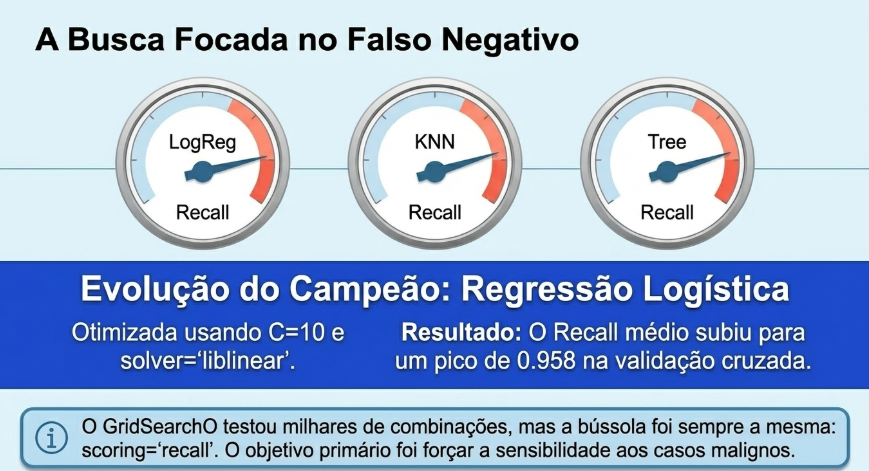

### 14.2 Melhores parâmetros encontrados

| Modelo | Melhores parâmetros | Melhor recall médio na validação |
|---|---|---:|
| Regressão Logística | `C=10`, `solver='liblinear'` | 0.958467 |
| KNN | `metric='manhattan'`, `n_neighbors=3`, `weights='uniform'` | 0.929234 |
| Árvore de Decisão | `criterion='entropy'`, `max_depth=2`, `min_samples_leaf=1`, `min_samples_split=2` | 0.947059 |

### 14.3 Interpretação da melhoria

A melhoria do `GridSearchCV` ocorreu porque os modelos deixaram de usar parâmetros genéricos e passaram a usar combinações ajustadas para o objetivo do projeto.

No caso da Regressão Logística, a configuração `C=10` e `solver='liblinear'` aumentou a sensibilidade do modelo aos casos malignos. O resultado foi a redução de falsos negativos no conjunto de teste.

---

## 15. Resultados dos Modelos Otimizados

| Modelo | Acurácia | Precisão Classe 1 | Recall Classe 1 | F1-score Classe 1 |
|---|---:|---:|---:|---:|
| Regressão Logística Otimizada | 0.973684 | 0.954545 | 0.976744 | 0.965517 |
| KNN Otimizado | 0.964912 | 0.953488 | 0.953488 | 0.953488 |
| Árvore Otimizada | 0.912281 | 0.836735 | 0.953488 | 0.891304 |

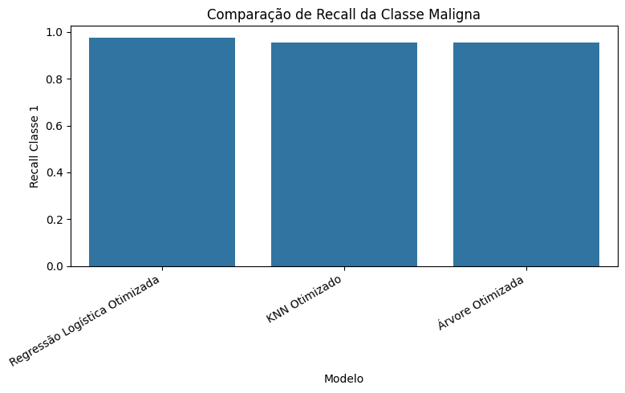

### 15.1 Análise da tabela final

A Regressão Logística Otimizada foi o melhor modelo final, pois apresentou:

- Maior recall da classe maligna.
- Melhor F1-score da classe maligna.
- Alta acurácia.
- Boa precisão.
- Boa interpretabilidade.

O KNN Otimizado apresentou bom resultado, mas recall menor que a Regressão Logística Otimizada.

A Árvore Otimizada conseguiu recall bom, mas teve queda significativa de precisão e acurácia. Isso indica que ela passou a classificar mais casos como malignos, aumentando falsos positivos.

---

## 16. Matriz de Confusão do Modelo Final

A matriz de confusão da Regressão Logística Otimizada foi:

| Situação | Quantidade | Interpretação |
|---|---:|---|
| TN | 69 | Benignos corretamente classificados |
| FP | 2 | Benignos classificados como malignos |
| FN | 1 | Maligno classificado como benigno |
| TP | 42 | Malignos corretamente classificados |

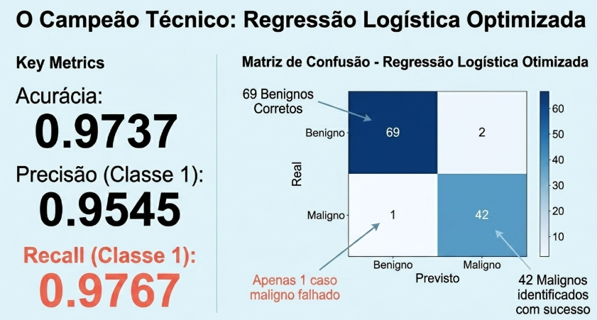

### 16.1 Análise final da matriz

O modelo final identificou corretamente **42 dos 43 casos malignos** do conjunto de teste. Apenas **1 caso maligno** foi classificado como benigno.

Essa redução é importante porque diminui o risco de um caso grave passar despercebido na triagem inicial.

Por outro lado, o modelo classificou **2 casos benignos como malignos**. Embora isso possa gerar investigação adicional desnecessária, esse erro é menos grave do que deixar passar um caso maligno.

---

## 17. Ajuste de Threshold

### 17.1 O que é threshold?

Modelos como a Regressão Logística retornam uma probabilidade. Por padrão, o limite de decisão geralmente é 0.50.

Isso significa:

- Probabilidade menor que 0.50: classifica como benigno.
- Probabilidade maior ou igual a 0.50: classifica como maligno.

Esse limite é chamado de **threshold**.

### 17.2 Por que ajustar o threshold?

No contexto médico, pode ser interessante reduzir o threshold para tornar o modelo mais sensível aos casos malignos.

Ao reduzir o threshold, o modelo passa a sinalizar como malignos alguns casos que antes ficariam como benignos.


### 17.3 Comparação entre thresholds

| Threshold | Falsos Negativos | Casos malignos detectados | Acurácia global |
|---:|---:|---:|---:|
| 0.50 | 2 | 41 | 0.973 |
| 0.45 | 1 | 42 | 0.982 |

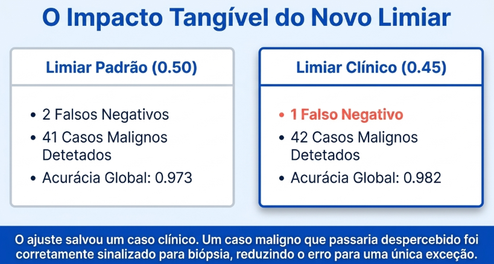

### 17.4 Interpretação

Ao reduzir o threshold de 0.50 para 0.45, o modelo ficou mais sensível e conseguiu identificar um caso maligno adicional.

Na prática, isso significa que um tumor maligno que poderia passar despercebido passou a ser sinalizado para investigação.

### 17.5 Ponto de equilíbrio clínico

A análise mostrou que 0.45 foi um bom ponto de equilíbrio, pois melhorou a detecção de malignos sem gerar aumento desnecessário de falsos positivos.

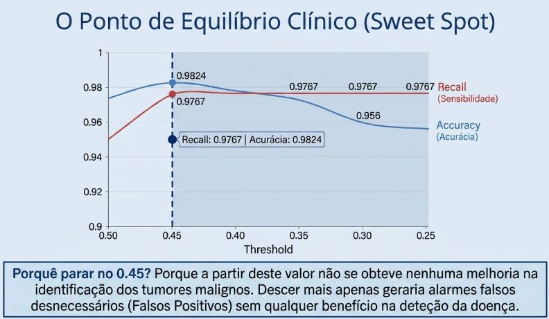

Reduzir demais o threshold poderia gerar muitos alarmes falsos. Por isso, o threshold não deve ser escolhido apenas por desempenho matemático, mas considerando o impacto clínico.

---

## 18. Interpretabilidade do Modelo

A interpretabilidade é essencial em aplicações médicas. Um modelo não deve apenas prever, mas também permitir uma explicação sobre quais variáveis influenciaram a decisão.

### 18.1 Coeficientes da Regressão Logística

Na Regressão Logística, os coeficientes indicam a influência das variáveis na classificação.

- Coeficientes positivos aumentam a probabilidade de classificação como maligno.
- Coeficientes negativos reduzem a probabilidade de classificação como maligno.

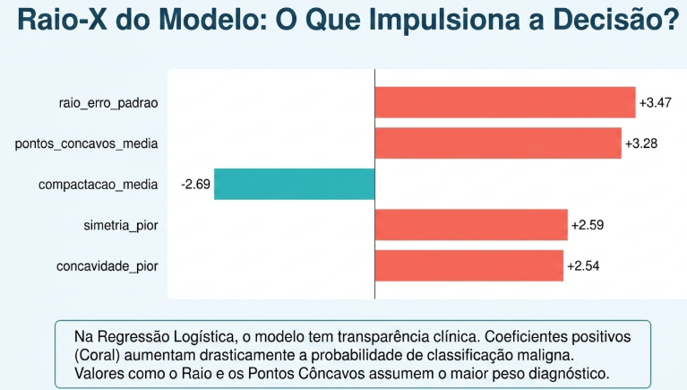

### 18.2 Variáveis com maior impacto no modelo

Entre as variáveis destacadas, apareceram:

| Variável | Interpretação |
|---|---|
| `raio_erro_padrao` | Variações maiores no raio podem indicar irregularidade |
| `pontos_concavos_media` | Pontos côncavos estão fortemente associados à malignidade |
| `compactacao_media` | Mede o grau de compactação celular |
| `simetria_pior` | Alterações na simetria podem indicar irregularidade |
| `concavidade_pior` | Concavidade elevada sugere contornos mais irregulares |
| `textura_pior` | Textura alterada pode contribuir para a classificação |
| `area_erro_padrao` | Variações na área ajudam a diferenciar padrões |
| `area_pior` | Área elevada aparece associada a malignidade |
| `raio_pior` | Raio elevado no pior caso é relevante |
| `concavidade_erro_padrao` | Variação da concavidade ajuda na separação das classes |

### 18.3 Feature importance da Árvore

A Árvore Otimizada destacou principalmente:

| Variável | Importância |
|---|---:|
| `pontos_concavos_media` | 0.761452 |
| `perimetro_pior` | 0.136251 |
| `raio_pior` | 0.102297 |

Isso reforça a análise de correlação: variáveis relacionadas à irregularidade e tamanho do tumor possuem forte relação com malignidade.


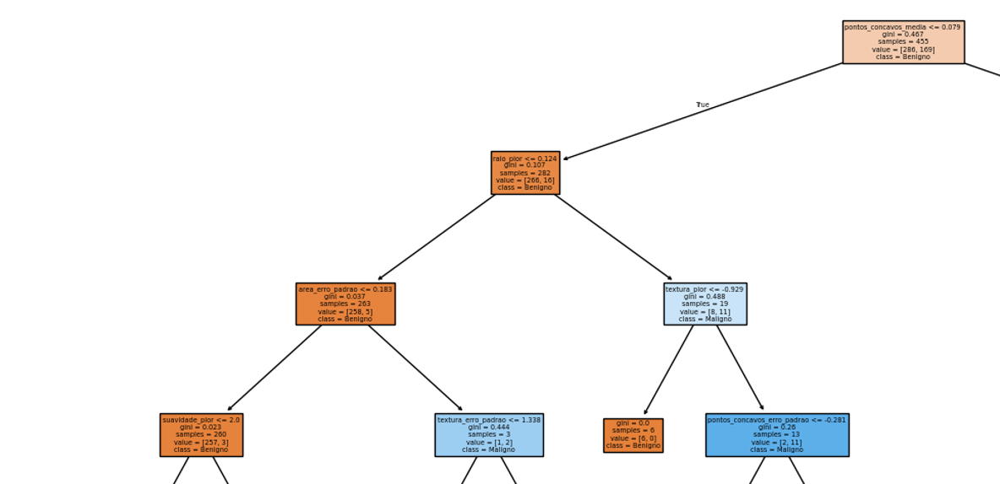


---


### 19 Conclusão

O projeto demonstrou que é possível construir uma solução inicial de Machine Learning para apoio ao diagnóstico de câncer de mama utilizando dados estruturados.

O principal objetivo do projeto foi reduzir falsos negativos

O modelo final conseguiu identificar **42 dos 43 casos malignos**

Além disso, o ajuste do threshold para 0.45 mostrou que a sensibilidade do modelo pode ser calibrada de acordo com o contexto clínico

Mesmo com resultados promissores, o modelo deve ser utilizado apenas como ferramenta de apoio. 

---
